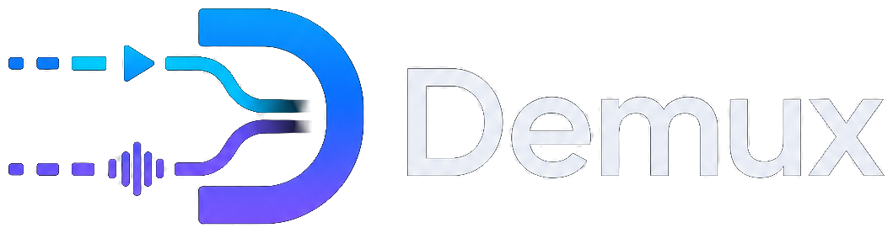

<p align="center">
  
</p>

<p align="center">
  Extract clean audio from video files with FFmpeg.
</p>

# Demux

Demux is a native Rust desktop application for extracting audio from local
video files. It makes the FFmpeg workflow visible and approachable: add media,
inspect what was found, choose how and where to save the audio, then follow the
queue through completion, failure, cancellation, or pause.

> **Status:** active development. The extraction workflow is functional, and
> tagged releases publish portable Linux archives and Debian packages for
> Linux x86_64. Native installers for additional platforms are not yet
> available.

## Current capabilities

- Add individual files or folders, or drop them into the application. Folder
  imports discover supported media recursively and preserve a stable queue
  order.
- Probe each item asynchronously with FFprobe, show the discovered media
  details, and keep invalid, duplicate, or unreadable inputs from blocking
  valid work.
- Extract eligible jobs sequentially as MP3 with validated 128–320 kbps
  bitrate, 44.1/48 kHz sample-rate, and mono or stereo output.
- Choose an output folder, preserve safe paths from folder imports, and avoid
  overwriting existing files by selecting a numbered filename.
- Copy allowlisted metadata and compatible embedded artwork when enabled.
- Optionally apply two-pass EBU R128 loudness normalization targeting −23 LUFS
  with a decoded −1 dBTP ceiling.
- Follow active work through percentage, elapsed time, speed, bitrate, output
  size, and remaining-time estimates when FFmpeg provides those values.
- View bounded, timestamped FFmpeg output in the app, then clear or export the
  retained log without affecting structured tracing.
- Cancel the entire queue safely, including partial-output cleanup. Unix builds
  also support pause and resume through a dedicated FFmpeg process group;
  unsupported platforms report that limitation explicitly.
- Open Settings for dependency rechecks, saved-default reset, window geometry
  retention, and shortcut guidance; About links the project, FFmpeg, and the
  GPL-3.0-only license.
- Use the compact responsive layout at narrower window widths, with Start
  Ripping anchored in Progress and dialogs protecting active work on close.

Supported intake extensions are MP4, MKV, MOV, AVI, WMV, FLV, MPEG, and MPG.
Whether a file can be extracted still depends on the codecs available to the
locally installed FFmpeg build.

## Requirements

- [FFmpeg](https://ffmpeg.org/) available as `ffmpeg` on `PATH`
- FFprobe available as `ffprobe` on `PATH`
- A desktop environment supported by [Iced](https://github.com/iced-rs/iced)

Building from source additionally requires
[Rust](https://www.rust-lang.org/tools/install) and Cargo. FFmpeg and FFprobe
are not needed merely to compile or run the unit tests, but Demux checks for
both before it accepts work.

### Linux note

Demux currently uses X11 or XWayland on Linux. Iced 0.14 does not emit desktop
file-drop events through its Wayland backend, so native Wayland support remains
disabled until that upstream capability is available.

## Install a release

Linux release archives, Debian packages, and SHA-256 checksums are published on
the [GitHub Releases page](https://github.com/arapsum/demux/releases).

On Debian or Ubuntu x86_64, install the `.deb` package with:

```bash
sudo apt install ./demux_0.1.2_amd64.deb
```

The package installs FFmpeg and the desktop launcher as Debian dependencies.
Replace `0.1.2` with the version you downloaded. To use the portable archive
instead, install FFmpeg with your distribution's package manager, verify the
download, extract it, and launch `demux`:

```bash
sha256sum --check demux-0.1.2-x86_64-unknown-linux-gnu.tar.gz.sha256
tar -xzf demux-0.1.2-x86_64-unknown-linux-gnu.tar.gz
cd demux-0.1.2-x86_64-unknown-linux-gnu
./demux
```

See [INSTALL.md](INSTALL.md) for distribution-specific FFmpeg commands,
troubleshooting, and optional desktop integration. See
[docs/RELEASING.md](docs/RELEASING.md) for the package build and release
procedure.

## Build from source

From the repository root:

```bash
cargo run
```

Then add one or more videos, confirm the output folder and MP3 settings, and
select **Start Ripping**. Existing output files are never overwritten: Demux
chooses the next available numbered name instead.

For additional runtime diagnostics, enable tracing before launching:

```bash
RUST_LOG=demux=debug cargo run
```

Release builds write structured tracing to human-readable daily log files.
Files are named `demux.YYYY-MM-DD.log`; the seven most recent files are
retained in the following locations:

- Linux: `$XDG_STATE_HOME/demux/logs`, or `~/.local/state/demux/logs`.
- macOS: `~/Library/Logs/Demux`.
- Windows: `%LOCALAPPDATA%/Demux/logs`.

Set `DEMUX_LOG_DIR` to choose an alternate directory. `RUST_LOG` also applies
to release log files; it defaults to `demux=info`. The production tracing files
are separate from the bounded FFmpeg log shown in the application and exported
with **Save Log**.

## Development

The same checks used by continuous integration are useful before submitting a
change:

```bash
cargo fmt --all -- --check
cargo clippy --all-targets --all-features -- -D warnings
cargo test --all-targets --all-features
```

The FFmpeg normalization and pause/resume integration tests require local
FFmpeg and FFprobe, and are therefore ignored by default. Run them explicitly
when those tools are available:

```bash
cargo test --test ffmpeg_normalization -- --ignored
cargo test --test ffmpeg_pause -- --ignored
```

## Architecture

The FFmpeg engine remains independent of the Iced view layer. The GUI renders
state and forwards explicit actions; application and adapter layers own probing,
command construction, process management, progress parsing, logging, and
recovery.

```text
Iced UI
  ↓ messages and state updates
Application model
  ↓ jobs and settings
FFmpeg service
  ├── ffprobe: inspect media
  ├── ffmpeg: extract audio
  └── bounded progress and log events: update the UI
```

`Demux` is the GUI composition root. Each substantial surface owns its local
state, messages, initialization, update logic, and view; the root maps child
tasks when a workflow crosses a boundary.

```text
Demux
  ├── Queue            → intake, probing, selection, and job presentation
  ├── Progress         → active extraction measurements and controls
  ├── Logs             → bounded FFmpeg output, retention, and export
  ├── OutputSettings   → encoding and destination choices
  ├── ApplicationSettings → preferences, dependencies, and shortcuts
  ├── About            → product identity and external links
  ├── CloseConfirmation → safe shutdown while extraction is active
  ├── WindowState      → persisted geometry and responsive layout state
  └── Notifications    → transient completion and failure feedback
```

Subsystem adapters retain their specific error types. Application runtime
operations promote failures into the unified `demux::Error`, and the GUI turns
them into persistent job state or user-facing messages only at its boundary.

## Roadmap

Milestones 0–10 are complete: GUI composition, intake, sequential execution,
live progress, cancellation, configurable MP3 output, metadata/artwork,
normalization and folder structure, FFmpeg logs, Unix pause/resume, and the
complete responsive shell with preferences, dialogs, shortcuts, and safe close.

See [ROADMAP.md](ROADMAP.md) for the engine-first milestone plan and its exit
criteria.

## License

Demux is licensed under the [GNU General Public License v3.0 only](LICENSE).
